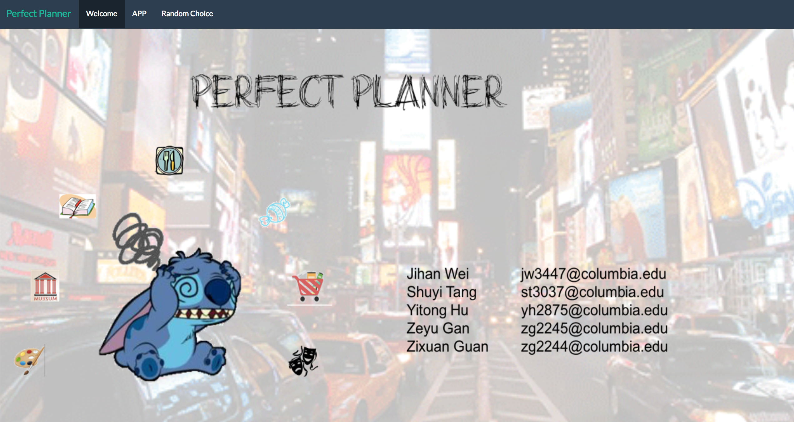

# Project 2: Open Data App - an RShiny app development project

## Project Title: Perfect Planner ---Plan for your perfect day

Term: Spring 2017

+ **Team 14**
+ **Perfect Planner ---Plan for your perfect day**

+ **Team members**
	+ Jihan Wei
	+ Shuyi Tang
	+ Yitong Hu
	+ Zeyu Gan
	+ Zixuan Guan




**Do you have allodoxaphobia?** 

**Do you have trouble with deciding how to spend your spare time?** 

**Do you have trouble with finding places for your favorite activity?** 


**If “Yes”, here is Your Savior!!** 
+ **Try our App [Perfect Planner] via Link: https://adsproj2group14.shinyapps.io/perfectplanner/**


+ **Summary**: 
 Image that on the morning of a sunny weekend, you want to go out for fun but have no idea about what to do or you have plenty of preferences in heart but can’t find a place to fulfill all your needs. Under such unpleasant situations, our app can save you out~ 

  In our app, after entering your current location, you can choose your top 3 “Most want-to-go places” to search for recommended areas that contain all your choices. Among all the recommendations, you can zoom in to have more detailed information about that area and then decide where to start your perfect day! 

 Opps! If you currently have no idea of what to do, don’t worry! Our app can even randomly choose them for you~


+ **Data Source**: 
 We mainly use U.S. government open data released on the [data.gov](https://data.gov/) website for building this shiny app. And the Deli and Market data can be found on the [NYC open data]( https://nycopendata.socrata.com/). 


+ **Contribution statement**: 
 We gain an enjoyable experience working together. All team members contributed equally in all stages of this project. All team members approve our work presented in this GitHub repository including this contributions statement. 

Following [suggestions](http://nicercode.github.io/blog/2013-04-05-projects/) by [RICH FITZJOHN](http://nicercode.github.io/about/#Team) (@richfitz). This folder is orgarnized as follows.

```
proj/
├── app/  (all files for running the app)
├── lib/  (all R files)
├── data/ (all the raw data and clearned data)
├── doc/  (all indirectly used R file and pictures for readme)
└── output/ 
```

Please see each subfolder for a README file.

